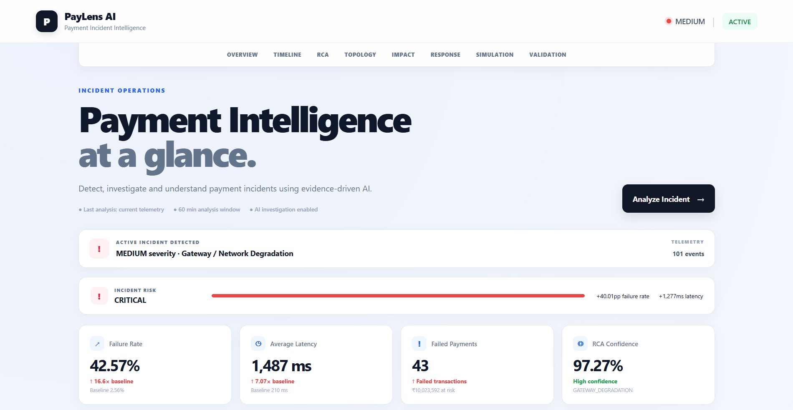
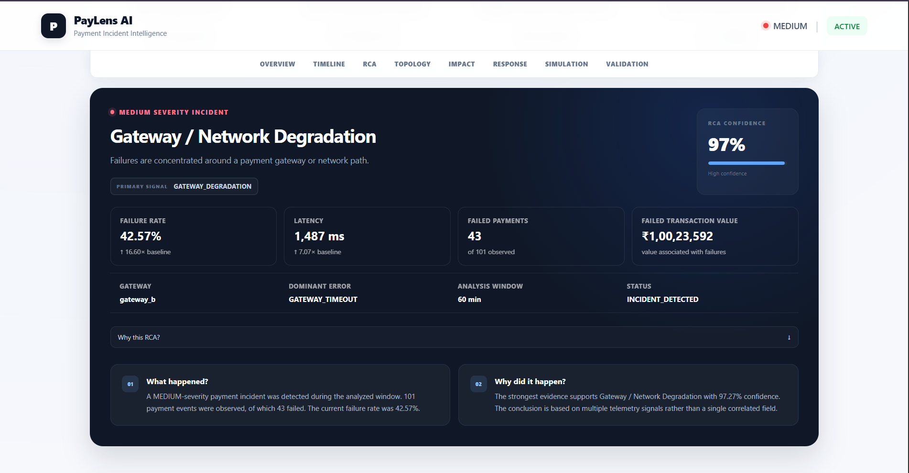
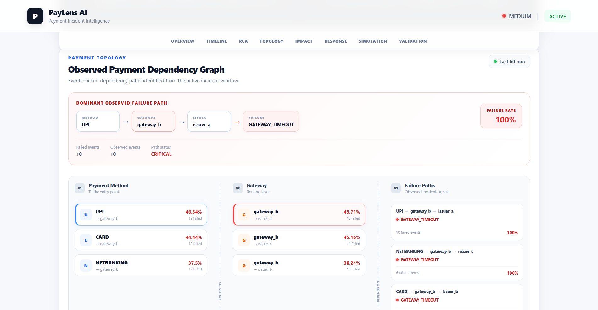
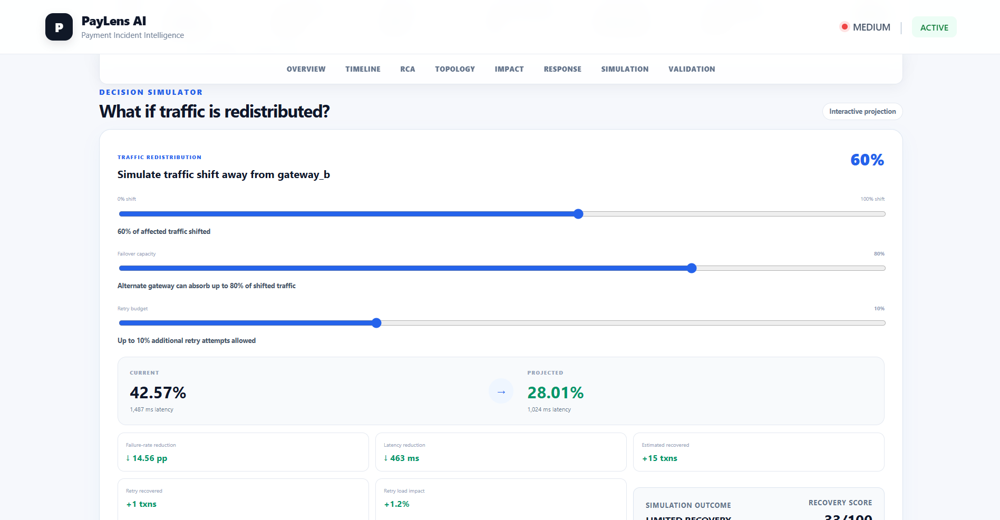
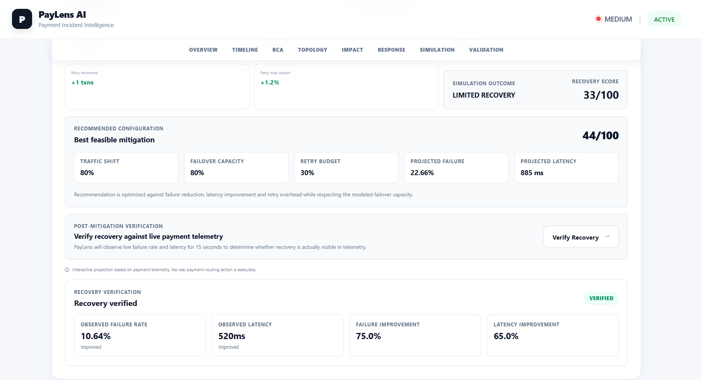
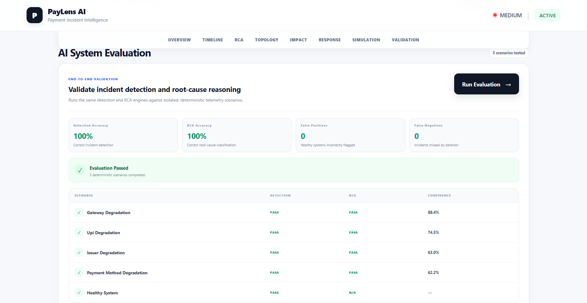
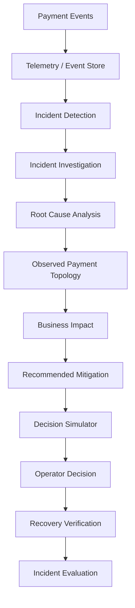
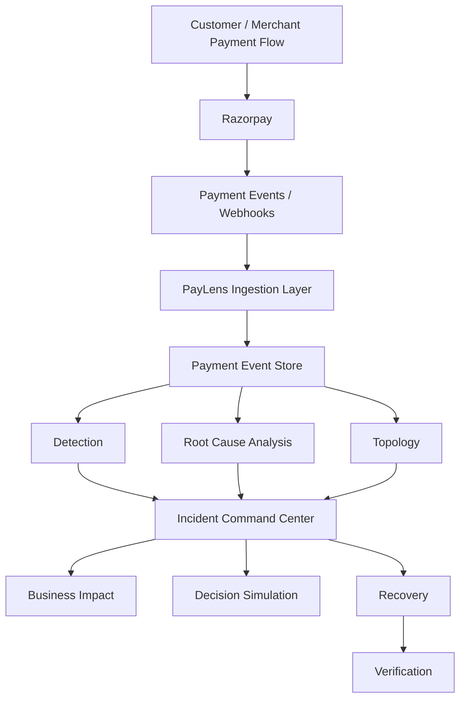

# PayLens AI

**Payment Incident Intelligence — detect, explain, simulate, and verify.**

PayLens AI is a payment incident intelligence and incident command system built for the **Razorpay Buildathon 2026 (Open Track)**. It helps payment operations teams move from "payments are failing" to a complete, evidence-backed incident workflow: detect degradation, understand the likely root cause, inspect the affected payment path, quantify business impact, evaluate mitigation strategies, and verify whether recovery actually occurred.

PayLens AI is an **observability / incident-intelligence / decision-support layer** that sits around payment operations. It is not a replacement for Razorpay, and it does not execute real payment routing or shift real production traffic.

---

## Dashboard Preview



---

## Table of Contents

1. [Why PayLens AI?](#why-paylens-ai-is-different)
2. [Problem Statement](#problem-statement)
3. [Solution](#solution)
4. [Key Capabilities](#key-capabilities)
5. [Product Walkthrough](#product-walkthrough)
6. [End-to-End Incident Workflow](#end-to-end-incident-workflow)
7. [Architecture](#architecture)
8. [Razorpay Positioning](#razorpay-positioning)
9. [RCA Example](#rca-example)
10. [Payment Topology Example](#payment-topology-example)
11. [Business Impact Example](#business-impact-example)
12. [Recovery Simulation Example](#recovery-simulation-example)
13. [Recovery Verification Example](#recovery-verification-example)
14. [Demo / User Interface](#demo--user-interface)
15. [API Endpoints](#api-endpoints)
16. [Tech Stack](#tech-stack)
17. [Project Structure](#project-structure)
18. [Local Development Setup](#local-development-setup)
19. [Environment Variables](#environment-variables)
20. [Security / Repository Hygiene](#security--repository-hygiene)
21. [Testing and Evaluation](#testing-and-evaluation)
22. [Demo Limitations](#demo-limitations)
23. [Production Evolution / Future Roadmap](#production-evolution--future-roadmap)
24. [Buildathon Positioning](#buildathon-positioning)
25. [Quick Demo Flow](#quick-demo-flow)
26. [License](#license)

---

## Problem Statement

Payment failures rarely announce themselves cleanly. During a real incident:

- **Failure rates can rise rapidly** — a healthy system can degrade within minutes.
- **Latency degradation often appears before outright failure**, making early signals easy to miss.
- **The affected layer is not always obvious** — it could be the gateway, a specific payment method, an issuer, or the underlying network.
- **Raw payment events are difficult to interpret manually.** Operators are staring at logs and dashboards, not answers.
- **Incident responders need evidence, not just alerts.** A red banner saying "failures are up" does not tell anyone what to do next.
- **Mitigation decisions carry real business impact.** Shifting traffic or disabling a payment method has consequences that need to be weighed, not guessed.
- **Operators need confidence that recovery actually happened**, rather than assuming a mitigation worked because the incident was closed.
- **Conventional dashboards stop at detection.** They rarely provide a complete decision workflow from "something is wrong" to "here is what to do, and here is proof it worked."

## Solution

PayLens AI is designed as an **incident command center for payment operations**. It combines:

- Payment telemetry ingestion and storage
- Deterministic, rule-based anomaly detection
- Deterministic root-cause reasoning across competing hypotheses
- An observed payment dependency topology, derived from real event data
- Business impact analysis on top of the detected incident
- Advisory remediation recommendations
- An interactive decision simulator for exploring mitigation trade-offs
- A controlled recovery verification workflow
- A deterministic evaluation suite

The emphasis throughout is **evidence-backed incident reasoning** — every conclusion PayLens surfaces is traceable back to the telemetry that produced it, rather than being presented as an opaque alert.

The full lifecycle PayLens implements is:

```
Telemetry → Detection → Investigation → Root Cause Analysis → Payment Topology
→ Business Impact → Recommended Action → Decision Simulation
→ Recovery Verification → Evaluation
```

At each stage, PayLens is answering one of seven operational questions:

1. **What is happening?**
2. **Why is it happening?**
3. **Which payment path is affected?**
4. **What is the business impact?**
5. **What should an operator do?**
6. **What could happen if that mitigation is applied?**
7. **Did recovery actually occur?**

---

## Key Capabilities

### Payment Telemetry

PayLens normalizes and stores payment telemetry events with attributes including:

- Payment status
- Amount and currency
- Payment method
- Gateway
- Issuer
- Retry count
- Latency
- Error code / description
- Timestamps

### Incident Detection

Detection is **deterministic and rule-based** — it compares a current analysis window against a preceding baseline window rather than relying on a trained ML anomaly model.

| Parameter                                    | Value                                   |
| -------------------------------------------- | --------------------------------------- |
| Minimum events required (baseline & current) | 20 events each                          |
| Failure multiplier threshold                 | 2.0x                                    |
| Absolute failure threshold                   | 50%                                     |
| Latency multiplier threshold                 | 2.0x                                    |
| Analysis window                              | Configurable via API (`window_minutes`) |

If there isn't enough telemetry in either window, the detector explicitly returns an **insufficient baseline data** result rather than guessing.

### Root Cause Analysis

PayLens evaluates a fixed set of competing hypotheses:

- `GATEWAY_DEGRADATION`
- `GENERAL_PAYMENT_DEGRADATION`
- `UPI_DEGRADATION`
- `ISSUER_DEGRADATION`
- `PAYMENT_METHOD_DEGRADATION`

Each hypothesis is scored against telemetry evidence signals — gateway errors, overall failure rate, latency, gateway-specific failure rate, and gateway isolation/concentration — and the highest-scoring hypothesis is selected as the primary root cause.

The UI surfaces:

- Primary root cause
- Confidence
- Evidence score
- Supporting signals
- Competing hypotheses (with scores)
- A decision trace showing how the conclusion was reached

### Payment Topology

PayLens derives an **observed dependency graph** directly from payment events rather than from a preconfigured infrastructure map. Relationships captured include:

- Payment method → gateway
- Gateway → issuer
- Issuer → error
- Full observed payment paths

For example, the system can surface a dominant failed path such as:

```
UPI → gateway_b → issuer_a → GATEWAY_TIMEOUT
```

This represents an **observed combination of event attributes**, not a guaranteed physical network hop sequence.

### Business Impact

Implemented impact metrics:

- Transaction Value at Risk
- Failed Payments
- Value at Risk / Minute
- Average Failed Transaction
- Recovery Potential (value and percentage)

Transaction Value at Risk is deliberately not labeled "revenue at risk" — it reflects transaction value exposed during the incident window, not confirmed lost revenue.

### Advisory Remediation

Based on the detected incident, PayLens recommends operational actions such as:

- Reducing traffic to an affected gateway
- Inspecting gateway/upstream network health
- Applying an appropriate mitigation
- Evaluating retry behavior

These recommendations are **advisory only** — PayLens does not execute real payment routing changes.

### Decision Simulator

An interactive simulator lets operators explore "what-if" mitigation scenarios.

**Inputs:**

- Traffic Shift
- Failover Capacity
- Retry Budget

**Outputs:**

- Effective traffic shift
- Projected failure rate
- Projected latency
- Failure-rate reduction
- Latency reduction
- Estimated recovered transactions
- Retry recovery
- Retry load impact
- Simulation outcome
- Recovery score

The simulator also searches across feasible configurations and recommends a best feasible configuration using its scoring logic. This is a **controlled simulation** — it does not manipulate real production traffic.

### Recovery Verification

The recovery verification workflow currently uses a **controlled recovery telemetry endpoint**. It compares before/after failure rate and average latency, and reports:

- Recovery status
- Failure-rate improvement
- Latency improvement
- Whether failure recovered
- Whether latency recovered

Explicitly: no real payment-routing action is executed, the demo does not modify the database, and a production version of this workflow would rely on observed post-mitigation telemetry instead of controlled data.

### Deterministic Evaluation

A controlled evaluation suite tests PayLens against five scenarios:

1. Gateway Degradation
2. UPI Degradation
3. Issuer Degradation
4. Payment Method Degradation
5. Healthy System

**Current results:** Detection Accuracy 100%, RCA Accuracy 100%, 0 False Positives, 0 False Negatives. This reflects a **controlled, deterministic evaluation suite**, not a claim about production-wide accuracy.

---

## Product Walkthrough

### 1. Incident Command Center


The main dashboard, showing the incident overview, timeline, and navigation across every stage of the incident workflow.

### 2. RCA Decision Trace



Shows the selected root cause, confidence, evidence score, supporting signals, and competing hypotheses considered before the primary root cause was chosen.

### 3. Payment Topology



Shows the observed payment dependency relationships derived from event data, including the dominant failed path.

### 4. Decision Simulator



Lets operators adjust traffic shift, failover capacity, and retry budget, and observe the projected recovery outcome before committing to a mitigation.

### 5. Recovery Verification



Demonstrates the controlled recovery verification workflow, comparing before/after telemetry to determine whether recovery was actually observed.

### 6. Evaluation



Shows the controlled evaluation suite and its per-scenario detection/RCA results.

---

## End-to-End Incident Workflow



- **Payment Events** — raw payment activity, including Razorpay webhook events where configured.
- **Telemetry / Event Store** — normalized, persisted payment event records.
- **Incident Detection** — baseline-vs-current window comparison to flag degradation.
- **Incident Investigation** — operator drills into the flagged window.
- **Root Cause Analysis** — competing hypotheses are scored against evidence.
- **Observed Payment Topology** — affected payment path is surfaced from event data.
- **Business Impact** — value at risk and recovery potential are quantified.
- **Recommended Mitigation** — advisory remediation actions are suggested.
- **Decision Simulator** — operator explores mitigation trade-offs interactively.
- **Operator Decision** — a human decides which action to pursue.
- **Recovery Verification** — before/after telemetry confirms whether recovery occurred.
- **Incident Evaluation** — the deterministic evaluation suite validates detection/RCA behavior.

---

## Architecture



**Razorpay is the payment infrastructure. PayLens is the intelligence / observability and decision-support layer built around it.** Razorpay webhook ingestion is implemented in the backend, feeding payment events into the PayLens event store, which powers detection, RCA, and topology analysis in parallel. Their outputs converge in the Incident Command Center, which drives business impact analysis, decision simulation, and the recovery verification workflow.

---

## Razorpay Positioning

- PayLens AI is designed around **payment operations telemetry**.
- **Razorpay webhook events can be ingested by the backend.**
- PayLens analyzes payment events for operational intelligence — detection, root cause analysis, topology, and impact.
- **PayLens does not replace Razorpay payment processing.**
- **PayLens does not claim to execute real payment routing.**
- Mitigation recommendations are **advisory** — they inform an operator's decision, not an automated action.
- Actual routing or configuration changes remain under **merchant / Razorpay operational control**.

If a system like **Razorpay Optimizer** is involved, PayLens treats it only as a possible future production routing/control layer — PayLens does not currently control it.

### Future Production Architecture (not current functionality)

```
Razorpay / Optimizer
  → payment telemetry
  → PayLens
  → incident detection
  → root cause
  → affected path
  → mitigation recommendation
  → simulation
  → operator approval
  → routing/configuration change
  → post-mitigation telemetry
  → PayLens recovery verification
```

This flow is a **future/production concept**, not something implemented in this repository today.

---

## RCA Example

A controlled incident from the implemented test data:

**Baseline window**

| Metric          | Value     |
| --------------- | --------- |
| Events          | 39        |
| Failure Rate    | 2.56%     |
| Average Latency | 210.43 ms |

**Current incident window**

| Metric                 | Value           |
| ---------------------- | --------------- |
| Events                 | 101             |
| Failed Payments        | 43              |
| Successful Payments    | 58              |
| Failure Rate           | 42.57%          |
| Average Latency        | 1486.98 ms      |
| Failure Multiplier     | 16.6x           |
| Latency Multiplier     | 7.07x           |
| Dominant Error         | GATEWAY_TIMEOUT |
| gateway_b Failure Rate | 43%             |

**Root Cause Analysis**

- **Primary Root Cause:** `GATEWAY_DEGRADATION` (presented in the UI as "Gateway / Network Degradation")
- **Confidence:** ~97%
- **Evidence Score:** +110

**Supporting evidence**

| Signal               | Contribution |
| -------------------- | ------------ |
| Gateway Error        | +40          |
| Failure Rate         | +20          |
| Latency              | +15          |
| Gateway Failure Rate | +15          |
| Gateway Isolation    | +20          |

**Competing hypotheses**

| Hypothesis                  | Score |
| --------------------------- | ----- |
| General Payment Degradation | 30    |
| UPI Service Degradation     | 25    |
| Issuer-Specific Degradation | 10    |
| Payment Method Degradation  | 10    |

`GATEWAY_DEGRADATION` wins because the evidence is concentrated on gateway-specific signals — a high gateway error contribution, a gateway-specific failure rate isolated to `gateway_b`, and gateway isolation/concentration — rather than being spread evenly across payment methods or issuers, which is what the lower-scoring competing hypotheses would require.

---

## Payment Topology Example

Observed dominant failed path from the same incident:

```
UPI → gateway_b → issuer_a → GATEWAY_TIMEOUT
```

| Metric              | Value |
| ------------------- | ----- |
| Events on this path | 10    |
| Failed events       | 10    |
| Failure rate        | 100%  |

This represents an **observed dependency combination derived from payment events**, not a guaranteed end-to-end network trace.

---

## Business Impact Example

Calculated from the controlled incident telemetry and simulator state:

| Metric                     | Value                                |
| -------------------------- | ------------------------------------ |
| Transaction Value at Risk  | ₹1,00,23,592                         |
| Failed Payments            | 43                                   |
| Value at Risk / Minute     | ₹1,67,060                            |
| Average Failed Transaction | ₹2,33,107                            |
| Recovery Potential         | ₹34,96,602 (~34.9% of value at risk) |

---

## Recovery Simulation Example

**Before**

| Metric       | Value    |
| ------------ | -------- |
| Failure Rate | 42.57%   |
| Latency      | 1,487 ms |

**After simulated mitigation**

| Metric                           | Value                   |
| -------------------------------- | ----------------------- |
| Failure Rate                     | 19.16%                  |
| Latency                          | 595 ms                  |
| Estimated recovered transactions | 24                      |
| Failure-rate reduction           | 23.41 percentage points |
| Latency reduction                | 892 ms                  |
| Recovery Score                   | 91.14%                  |

This simulation represents **expected impact**, not actual production routing behavior.

---

## Recovery Verification Example

**Before**

| Metric          | Value      |
| --------------- | ---------- |
| Failure Rate    | 42.57%     |
| Average Latency | 1486.98 ms |

**After**

| Metric          | Value     |
| --------------- | --------- |
| Failure Rate    | 10.64%    |
| Average Latency | 520.44 ms |

**Observed improvement**

| Metric                   | Value |
| ------------------------ | ----- |
| Failure-rate improvement | 75.0% |
| Latency improvement      | 65.0% |

**Status:** `RECOVERY_OBSERVED`

**Simulation vs. Verification:** Simulation represents _what we expect to happen_. Verification represents _what the observed post-mitigation telemetry shows_. In the current demo, verification data comes from a controlled recovery telemetry endpoint rather than real production traffic.

---

## Demo / User Interface

The frontend is presented as an **Incident Command Center** with the following sections:

- Overview
- Timeline
- Incident RCA / Decision Trace
- Payment Topology
- Business Impact
- Response / Recommended Actions
- Decision Simulation
- Recovery Verification
- Evaluation

Sticky section navigation keeps operators oriented across a compact, operational dashboard layout as they move through the incident workflow.

---

## API Endpoints

| Endpoint                                         | Description                                                                   |
| ------------------------------------------------ | ----------------------------------------------------------------------------- |
| `GET /incidents/investigate?window_minutes=60`   | Runs detection + investigation over the specified analysis window.            |
| `GET /incidents/remediation?window_minutes=60`   | Returns advisory remediation recommendations for the current incident.        |
| `GET /incidents/topology?window_minutes=60`      | Returns the observed payment dependency topology and dominant failed path.    |
| `GET /incidents/recovery-demo?window_minutes=60` | Returns the controlled recovery verification result (before/after telemetry). |
| `GET /evaluation/run`                            | Runs the deterministic evaluation suite across the fixed test scenarios.      |
| `GET /telemetry/live?window_minutes=5`           | Returns live payment telemetry for the specified window.                      |

### Razorpay Webhooks

The backend exposes Razorpay webhook ingestion with signature verification for inbound payment events.

Interactive API documentation (FastAPI Swagger/OpenAPI) is available at:

```
/docs
```

---

## Tech Stack

### Backend

- Python
- FastAPI
- Uvicorn
- SQLite
- Pydantic
- Razorpay webhook integration / signature verification

### Frontend

- React
- Vite
- JavaScript / JSX
- CSS

No additional infrastructure (Docker, Redis, PostgreSQL, Kafka, Kubernetes, LangChain, OpenAI API, or any cloud provider SDKs) is part of the current implementation. Any such components mentioned elsewhere in this document are explicitly labeled as **future production architecture**, not current technology.

---

## Project Structure

```
PayLens-AI/
├── backend/       # FastAPI service: telemetry ingestion, detection, RCA,
│                  # topology, business impact, simulation, recovery, evaluation
├── frontend/      # React + Vite Incident Command Center UI
├── assets/        # README screenshots
└── README.md
```

The `backend/` directory is responsible for ingesting payment telemetry (including Razorpay webhooks where configured), running detection and root-cause analysis, computing topology and business impact, serving the decision simulator, and exposing the evaluation suite via the FastAPI API. The `frontend/` directory implements the Incident Command Center dashboard that consumes this API.

---

## Local Development Setup

Instructions below are for **Windows PowerShell**.

### Backend

```powershell
cd backend

# Create virtual environment
python -m venv .venv

# Activate
.\.venv\Scripts\Activate.ps1

# Install dependencies
pip install -r requirements.txt
```

Copy `.env.example` to `.env` and configure the variables described in [Environment Variables](#environment-variables). `PAYLENS_AI_PROVIDER` currently supports the deterministic fallback path.

Start the backend:

```powershell
python -m uvicorn app.main:app --reload
```

(Equivalently: `uvicorn app.main:app --reload`)

### Frontend

```powershell
cd frontend

npm install
npm run dev
```

The frontend API base URL is controlled by `VITE_API_BASE_URL` and falls back to `http://127.0.0.1:8000` for local development:

```
VITE_API_BASE_URL=http://127.0.0.1:8000
```

---

## Environment Variables

| Variable                  | Description                                                                        |
| ------------------------- | ---------------------------------------------------------------------------------- |
| `RAZORPAY_WEBHOOK_SECRET` | Razorpay webhook signing secret. **Private — never commit this value.**            |
| `PAYLENS_AI_PROVIDER`     | AI provider setting; currently supports the deterministic fallback provider.       |
| `FRONTEND_ORIGINS`        | Comma-separated list of frontend origins used for CORS.                            |
| `VITE_API_BASE_URL`       | Frontend URL for the PayLens backend API. Local fallback: `http://127.0.0.1:8000`. |

`.env` should never be committed to the repository.

---

## Security / Repository Hygiene

- `.env` is ignored.
- Local SQLite database files are ignored.
- Do not commit API keys.
- Do not commit webhook secrets.
- Do not commit local database files.
- Rotate webhook secrets immediately if they were ever exposed.
- Production deployments must use secure HTTPS webhook endpoints.
- Secrets should be managed through deployment environment variables, not source control.

This project does not claim any security certifications or production compliance status.

---

## Testing and Evaluation

Run the deterministic evaluation suite:

```
GET /evaluation/run
```

The evaluation runs against an **isolated in-memory SQLite database** and does not modify the local/production database.

| Scenario                   | Detection | RCA  |
| -------------------------- | --------- | ---- |
| Gateway Degradation        | PASS      | PASS |
| UPI Degradation            | PASS      | PASS |
| Issuer Degradation         | PASS      | PASS |
| Payment Method Degradation | PASS      | PASS |
| Healthy System             | PASS      | N/A  |

**Overall:** Detection Accuracy 100% · RCA Accuracy 100% · False Positives 0 · False Negatives 0

These are **controlled evaluation results** against a fixed set of scenarios, not a guarantee of production performance.

---

## Demo Limitations

This is a buildathon prototype, and the following boundaries are intentional rather than shortcomings:

- Recovery verification currently uses **controlled recovery telemetry**, not live production data.
- No real payment-routing action is executed by any part of the system.
- No real customer payments are manipulated.
- Local/demo SQLite data is used for storage.
- Simulation results are estimates based on the simulator's scoring logic, not measured outcomes.
- Root-cause reasoning currently uses a **deterministic fallback path**.
- A production deployment would additionally require real telemetry at scale, secure webhook infrastructure, production-grade persistence, authentication/authorization, observability, and operational safeguards.

These points mark the boundary between the current buildathon prototype and a production-ready system.

---

## Production Evolution / Future Roadmap

The following are **future improvements**, not implemented features:

1. Production-grade event ingestion
2. Secure Razorpay webhook deployment
3. Production database
4. Historical anomaly baselines
5. More sophisticated statistical / ML anomaly detection
6. Multi-gateway and payment-provider telemetry
7. Real-time alerting
8. Operator authentication and RBAC
9. Audit logs
10. Human approval workflow
11. Integration with routing/configuration systems
12. Automated post-mitigation telemetry verification
13. SLO/SLA monitoring
14. Incident notifications
15. Multi-merchant observability
16. Advanced dependency graphing
17. LLM-assisted investigation with grounded evidence

---

## Why PayLens AI Is Different

Most payment monitoring stops at a **failure alert**. PayLens AI goes further, toward **incident understanding + operational decision support + recovery verification**, combining:

- Evidence-backed root cause analysis
- Explicitly scored competing hypotheses
- An observed payment topology, not a static infrastructure diagram
- Quantified business impact
- Advisory mitigation recommendations
- An interactive what-if decision simulator
- Recovery verification against before/after telemetry
- A deterministic evaluation suite validating detection and RCA behavior

The result is a closed-loop incident workflow:

```
Detect → Explain → Quantify → Decide → Simulate → Verify
```

---

## Buildathon Positioning

PayLens AI is submitted to the **Razorpay Buildathon 2026, Open Track**, as a concept focused on:

- Payment reliability
- Payment operations tooling
- Incident intelligence
- Merchant impact
- Operational decision-making
- Faster diagnosis of payment degradation
- Safer, more informed mitigation decisions
- Measurable, verifiable recovery

This positioning reflects an Open Track concept rather than a claim to any specific assigned track.

---

## Quick Demo Flow

1. Open the PayLens dashboard.
2. Show the incident overview.
3. Show the failure/latency spike.
4. Open the RCA Decision Trace.
5. Show evidence and competing hypotheses.
6. Show the affected payment topology.
7. Show the business impact.
8. Show the recommended action.
9. Change the simulator controls.
10. Show the projected recovery.
11. Run recovery verification.
12. Show the evaluation results.

---

## License

License: Not specified.
